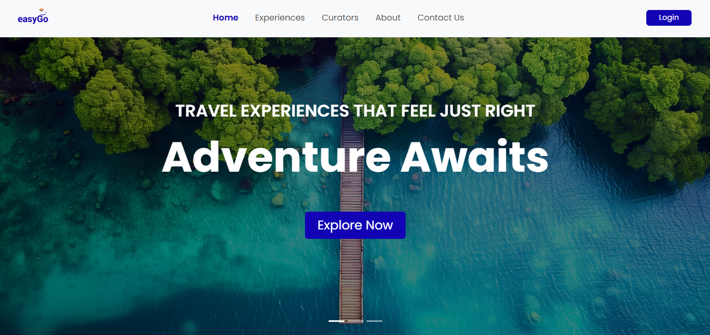
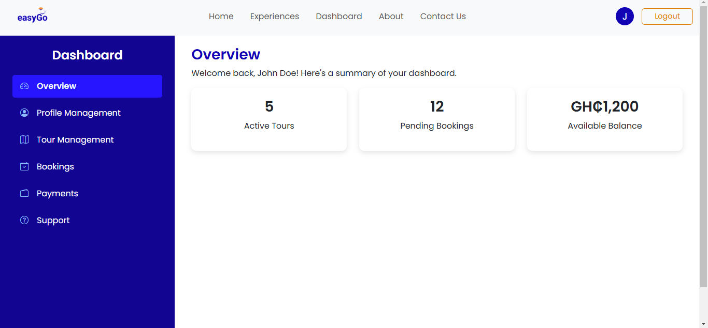
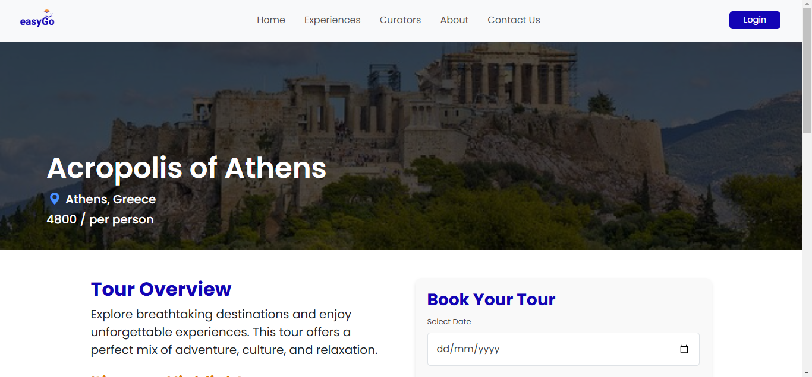
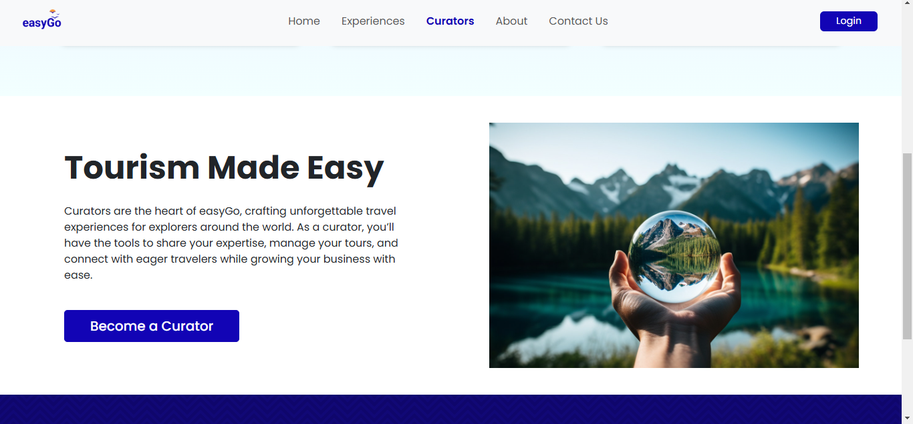
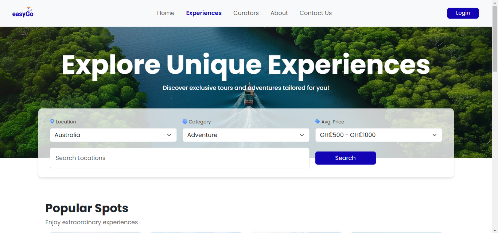
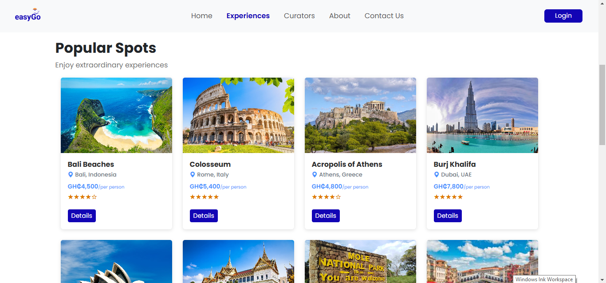

# 🌍 easyGo - Travel & Tour Booking Website  

## 🚀 An Improved Version of easyGo’s Website  

easyGo is a travel and tour booking platform designed to provide seamless experiences for tourists while empowering curators to showcase and manage their tours.  
This project is a **fully redesigned and improved version** of the existing easyGo website, built **from scratch** to enhance usability, security, and efficiency.  

---

## 📌 Features  

### 🔹 Tourist Experience  
- ✅ Browse & search for tours using **location, category, and price filters**  
- ✅ View **detailed tour pages** with images, pricing, and descriptions  
- ✅ Secure booking system with **various payment options**  
- ✅ Personalized **user dashboard**  

### 🔹 Curator Dashboard *(Role-Based Access)*  
- ✅ **Sign up & log in** as a curator to manage tours  
- ✅ **Add, edit, and delete** tours  
- ✅ Track **bookings & payments**  
- ✅ Secure & user-friendly dashboard  

### 🔹 Authentication & Role-Based Access  
- ✅ **Tourists** can browse, book, and interact with tours  
- ✅ **Curators** get exclusive access to manage tour listings  
- ✅ Restricted access—**tourists can’t access curator features**  

### 🔹 Responsive & Optimized for All Devices  
- ✅ **Fully mobile-friendly**  
- ✅ Optimized for **fast performance**  

---

## 🛠️ Technologies Used  

- **HTML, CSS (Bootstrap), JavaScript**  
- **Local Storage & Session Storage** for authentication  
- **Role-based access control (RBAC)**  
- **File handling for images & tour details**  

---

## 📸 Screenshots  

  
  
  
  
  
 

---

## 📩 Contact  

For any inquiries, collaborations, or feedback, feel free to reach out:  

- 📧 **Email**: [mwinkomnaab@gmail.com](mailto:mwinkomnaab@gmail.com)  
- 🔗 **LinkedIn**: [www.linkedin.com/in/mildred-naab-69a803188](www.linkedin.com/in/mildred-naab-69a803188)  
